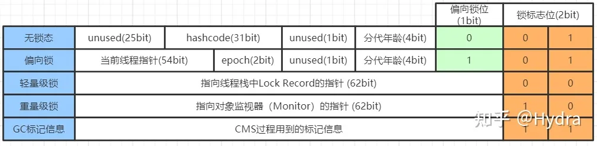

-Xss 栈空间

Linux环境下查看 JVM

top 

ps H -eo pid,tid,%cpu | grep 进程id （用ps命令进一步定位是哪个线程引起的cpu占用过高）

jstack 进程id


-Xmx 堆内存

jps：查看系统中的Java进程

jmap：查看堆内存占用情况  cmd :  jmap  -heap  进程id

jconsole：图形界面，多功能的监测工具，可以连续监测

jvisualvm：强力的监测工具 


-XX:MaxMetaspaceSize=8m  元空间大小

元空间内存溢出：java .lang.OutOfMemoryError: Metaspace

-XX:MaxPermSize=8m 	永久代内存大小

永久代内存溢出：java.lang.OutOfMemoryError: PermGen space


反编译

javap -v  *.class 


StringTable 垃圾回收

-Xmx10m  -XX:+PrintStringTableStatistics  -XX:+PrintGCDetails -verbose:gc


常量池HashTable的桶大小

-XX:StringTableSize=


操作系统内存  Unsafe类

```java
分配系统内存 ：   
unsafe.allocateMemory();
unsafe.setMemory();

释放内存
unsafe.freeMemory();
```


-XX:+DisableExplicitGC   禁用显示的垃圾回收（程序员无法直接操作 system.gc()无效）


## 垃圾回收

引用计数

jmap -dump:format=b,live,file=1.bin 进程id


强引用

软引用

弱引用

虚引用

终结器引用


# 对象的创建


1.当Java虚拟机遇到一条字节码new指令时

2.首先将去检查这个指令的参数是否能在常量池中定位到 一个类的符号引用

3.并且检查这个符号引用代表的类是否已被加载、解析和初始化过


## 指针碰撞(Bump The Pointer)

假设Java堆中内存是绝对规整的，所有被使用过的内存都被放在一 边，空闲的内存被放在另一边，中间放着一个指针作为分界点的指示器，那所分配内存就仅仅是把那 个指针向空闲空间方向挪动一段与对象大小相等的距离，这种分配方式称为“指针碰撞”(Bump The Pointer)。


## 空闲列表(Free List)

但如果Java堆中的内存并不是规整的，已被使用的内存和空闲的内存相互交错在一起，那 就没有办法简单地进行指针碰撞了，虚拟机就必须维护一个列表，记录上哪些内存块是可用的，在分 配的时候从列表中找到一块足够大的空间划分给对象实例，并更新列表上的记录，这种分配方式称 为“空闲列表”(Free List)。


选择哪种分配方式由Java堆是否规整决定，而Java堆是否规整又由所采用 的垃圾收集器是否带有空间压缩整理(Comp act)的能力决定。


一种是对分配内存空间的动作进行同步处理——实际上虚拟机是采用CAS配上失败 重试的方式保证更新操作的原子性;另外一种是把内存分配的动作按照线程划分在不同的空间之中进 行，即每个线程在Java堆中预先分配一小块内存，称为本地线程分配缓冲(Thread Local Allocation Buffer，TLAB)，哪个线程要分配内存，就在哪个线程的本地缓冲区中分配，只有本地缓冲区用完 了，分配新的缓存区时才需要同步锁定。虚拟机是否使用TLAB，可以通过-XX:+/-UseTLAB参数来 设定。


## 对象的内存布局

对象在堆内存中的存储布局可以划分为三个部分:对象头(Header)、实例

数据(Instance Data)和对齐填充(Padding)。


```java
org.example.entity.User object internals:
OFF  SZ   TYPE DESCRIPTION               VALUE
  0   8        (object header: mark)     0x0000000000000001 (non-biasable; age: 0)
  8   4        (object header: class)    0x00060a20
 12   4        (object alignment gap)    
Instance size: 16 bytes
Space losses: 0 bytes internal + 4 bytes external = 4 bytes total
```




Java 内存模型

程序计数器、Java虚拟机栈、本地方法栈（hotspot 中与java虚拟机栈合二为一）、Java堆、

方法区（元空间）、运行时常量池（方法区中）

```java
/**
* VM Args:-Xms20m -Xmx20m -XX:+HeapDumpOnOutOfMemoryError * @author zzm
*/
public class HeapOOM {
static class OOMObject { }
public static void main(String[] args) { List<OOMObject> list = new ArrayList<OOMObject>();
while (true) {
list.add(new OOMObject());
} }
}
```


虚拟机栈

由于HotSpot虚拟机中并不区分虚拟机栈和本地方法栈，因此对于HotSpot来说，-Xoss参数(设置 本地方法栈大小)虽然存在，但实际上是没有任何效果的，栈容量只能由-Xss参数来设定。

